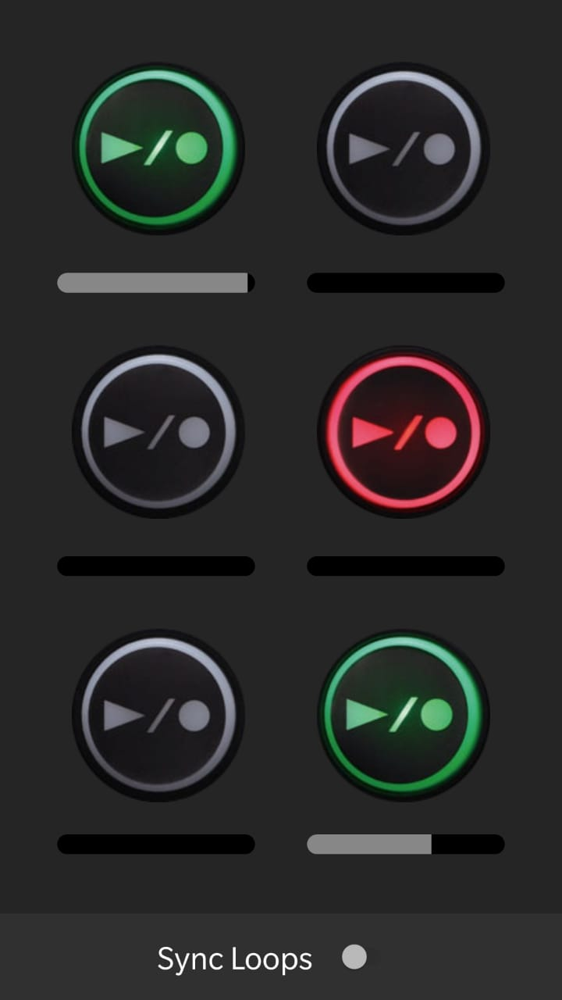

# Loop Box

* This app is aimed towards musicians who want to take their skills to the next level by looping the audio that they already produce!
* Loop Box allows musicains to record and loop audio.
* Music can be explored a lot by looping.

* Attached below is the screenshot of the app in action:

* This app is still in development stages, The features yet to be implemented are:

1. Syncing Loops together using a time signature
2. Adding Meteronome
3. Adding Output effects like reverb and echo
4. Mechanism to save projects